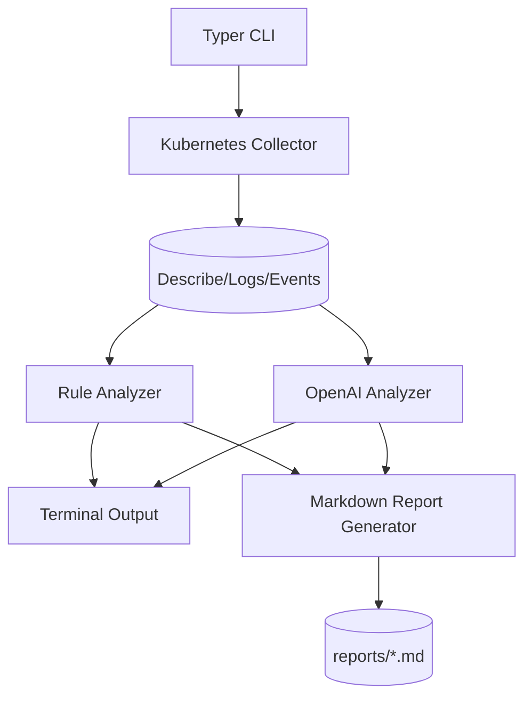

# ai-k8s-troubleshooter

AI-powered Kubernetes troubleshooting CLI for SRE and platform teams.

## Project Overview
`ai-k8s-troubleshooter` collects Kubernetes diagnostics, applies deterministic troubleshooting rules, optionally augments analysis with OpenAI, and generates professional Markdown incident reports.

## Features
- Automated Kubernetes pod diagnostics (`describe`, `logs`, and sorted namespace events)
- Rule-based detection for common failure patterns:
  - CrashLoopBackOff
  - ImagePullBackOff
  - ErrImagePull
  - Pending
  - OOMKilled
  - CreateContainerConfigError
- Optional OpenAI evidence-driven analysis (`gpt-4o-mini`)
- Professional Markdown report generation in `reports/`
- Rich terminal UX with colored status sections
- CI pipeline with Ruff + pytest + Docker build validation

## Architecture


## Installation
```bash
python -m venv .venv
source .venv/bin/activate
pip install -r requirements.txt
cp .env.example .env
```

## Usage
```bash
python -m src.cli --help
python -m src.cli diagnose pod flask-api -n dev
python -m src.cli diagnose pod flask-api -n dev --ai
```

The command is read-only and does not apply any Kubernetes mutation.

## AI Explanation Flow
1. Collect evidence via `kubectl`.
2. Build structured prompt with resource metadata and raw outputs.
3. Send evidence to OpenAI with strict SRE system prompt.
4. Print and store analysis; no cluster mutation operations are executed.
5. If OpenAI call fails, continue generating report with deterministic findings.

## Example Output (excerpt)
```text
Rule-based Findings:
- CrashLoopBackOff: Container repeatedly crashes after startup.
  Fix: Check app startup errors, env vars, probes, and dependencies.
```

## Screenshots
- `docs/screenshots/diagnose-success.png` (placeholder)
- `docs/screenshots/diagnose-ai-analysis.png` (placeholder)

## Future Roadmap
- Ollama local model provider
- Terraform plan/state analyzer
- GitHub Actions failure analyzer
- Prometheus alert context ingestion
- Slack/ChatOps integration

## Safety Guardrails
- Read-only diagnostics (`kubectl get/describe/logs/events`)
- No apply/delete/patch operations
- Evidence-only recommendations; unknowns are explicitly called out
